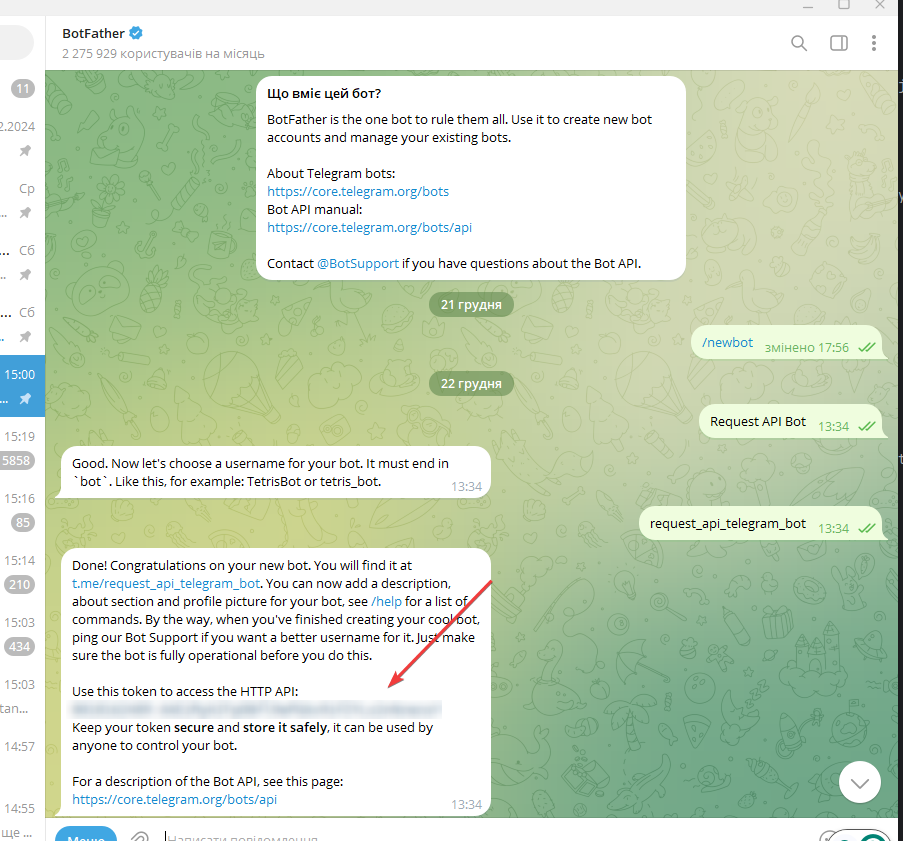
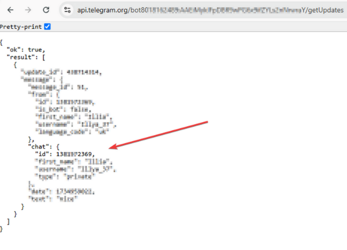

# Telegram Request API


## Description
This project is FastAPI service powered by PostgreSQL, featuring role-based access control, request handling, data storage, and Telegram messaging integration.


## Technologies Used
- Python
- FastAPI
- Telegram Bot
- PostgreSQL


## Features
- Role-based access control (Admin, Manager, User).
- Save and process JSON requests with PostgreSQL.
- Send messages and log responses via Telegram API.


## Setup
To install the project locally on your computer, execute the following commands in a terminal:
```bash
git clone https://github.com/Illya-Maznitskiy/telegram_request_api.git
cd telegram_request_api
python -m venv venv
venv\Scripts\activate (on Windows)
source venv/bin/activate (on macOS)
pip install -r requirements.txt
```

## Database
Ensure you have PostgreSQL installed

Open the terminal and log into PostgreSQL using the following command:
```bash
psql -U postgres
```

Create DB with command:
```bash
CREATE DATABASE fastapi_project_db;
```

Add an admin user to the DB:
```bash
CREATE USER admin_user WITH PASSWORD 'admin_password' SUPERUSER;
```

Grant access to the fastapi_project_db database:
```bash
GRANT ALL PRIVILEGES ON DATABASE fastapi_project_db TO admin_user;
```


## Migrations
Create and apply migrations with commands:
```bash
alembic revision --autogenerate -m "Initial migration"
alembic upgrade head
```


## Access
- To run the server use the command:
```bash
uvicorn main:app --reload
```

## API Endpoints
You can check and test the endpoints with URL [http://127.0.0.1:8000/docs/](http://127.0.0.1:8000/docs/)


## Authorization and Authentication

To use the API, visit [http://127.0.0.1:8000/docs/](http://127.0.0.1:8000/docs/) and follow these steps:

1. **Create a user**:  
   Send a `POST` request to the `/users` endpoint with your username, password, and role_name.  
   Choose one of the following role names:  
   - **Admin**  
   - **Manager**  
   - **User**  

  

2. **Get a token**:  
   Send a `POST` request to the `/token` endpoint with your username and password to receive a JWT token.  

  

3. **Use the token**:  
   Use the [ModHeader](https://modheader.com/) extension to add the token to the `Authorization` header of your requests.  
   - Set the **Name** to `Authorization`.  
   - Set the **Value** to `Bearer your_token`.

Now you can access the protected endpoints!


## Telegram Chat Setup

This section explains how to set up and use Telegram API in your project.

1. **Create a Telegram Bot with Token:**
   - Open Telegram and search for **BotFather**.
   - Start a conversation with BotFather and type `/newbot`.
   - Follow the prompts to create a new bot. BotFather will provide you a **bot token**.

  

2. **Get Chat ID:**
   - Send a message to your new bot.
   - Visit `https://api.telegram.org/bot<your-bot-token>/getUpdates` (replace `<your-bot-token>` with the token you got).
   - Find your **chat ID** in the response.

  

3. **Add Token to the Project:**
   - In your project, add the **bot token** to the `.env` file (create it with [sample.env](./sample.env)).


Now you're ready to interact with the Telegram API using your bot in the FastAPI service!


# Test Requests

Follow these steps to test the Telegram Bot requests:

1. **Run the Server**  
   Start the FastAPI application:  
   ```bash
   python main.py
   ```

2. **Create a Request**  
   Open [http://127.0.0.1:8000/docs/](http://127.0.0.1:8000/docs/)
   Send a POST request to `/requests` with the required fields:  
   - `bottoken`  
   - `chatid`
   - `message`  

3. **View Requests**  
   Use a GET request at `/requests` to see all saved requests.


# Screenshots:

## Authorization and Authentication

### Add New User


### Get Access Token


### Use Token in ModHeader


## Telegram Chat Setup

### Create a Telegram Bot


### Get Chat ID


### Add Token to Project


## Test Requests

### Send Request


### View Requests


## Database Structure

